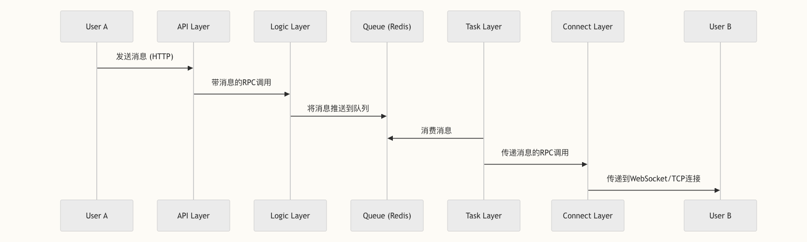

# go-im

## 参考
- [go-chat](https://github.com/LockGit/gochat)
- [如何设计一个IM单聊架构](https://juejin.cn/post/7110536715764236296)
- [如何设计一个亿级消息量的 IM 系统](https://learn.lianglianglee.com/%E6%96%87%E7%AB%A0/%E5%A6%82%E4%BD%95%E8%AE%BE%E8%AE%A1%E4%B8%80%E4%B8%AA%E4%BA%BF%E7%BA%A7%E6%B6%88%E6%81%AF%E9%87%8F%E7%9A%84%20IM%20%E7%B3%BB%E7%BB%9F.md)
- [一套分布式IM即时通讯系统的技术选型和架构设计](https://cloud.tencent.com/developer/article/2373215)

## 需求 
### 即时通讯需求
- 用户需要能够实时交流，无论是一对一还是群组聊天
- 消息必须实时可靠地投递，确保通讯顺畅

### 多终端接入需求
- 系统需要支持不同类型的客户端接入，包括Web和移动端
- 需要协议兼容性，使不同协议的客户端可以互相通信

### 可扩展性需求
- 随着用户规模增长，系统需要能够平滑扩容
- 系统架构需要支持高并发场景，避免单点瓶颈

### 房间管理需求
- 用户需要能够创建、加入和管理不同的聊天房间
- 房间内的消息需要能够快速广播给所有成员

### 认证与安全需求
- 需要用户身份验证机制确保通信安全
- 消息传输需要保证可靠性和完整性

### 性能需求
- 系统需要在高并发情况下保持稳定
- 消息投递需要低延迟，提供接近实时的用户体验

## 消息流程与传递


## 表结构
```sql
create table user
(
    id           bigint auto_increment
        primary key,
    username     char(20)                           not null,
    password     varchar(128)                       not null,
    gmt_create   datetime default current_timestamp not null,
    gmt_modified datetime default current_timestamp not null on update current_timestamp
);


```